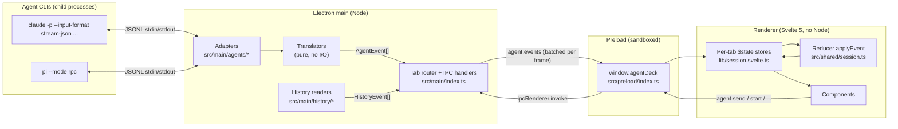

# Agent Deck architecture

This document describes how Agent Deck is put together: the processes it runs, the contracts between its layers, and where to make changes. The [README](../README.md) covers what the app does; this covers how.

## At a glance

Agent Deck is an Electron app that drives local coding-agent CLIs (Claude Code and Pi) as child processes speaking JSONL over stdio. Every agent's protocol is translated into one normalized event stream. A pure reducer turns that stream into UI state, and Svelte renders it.



## Source layout

| Path | Runs in | Responsibility |
| --- | --- | --- |
| `src/shared/` | main **and** renderer | Types and pure logic with no Electron or Svelte imports. Imported as `@shared/*`. |
| `src/shared/events.ts` | both | `AgentEvent`, the normalized event union, plus `StartOptions`, `AgentConfig`, prompt and MCP types. **The central contract.** |
| `src/shared/api.ts` | both | `AgentDeckApi` (the IPC surface), `AppSettings`, `SessionSummary`, `HistoryEvent`, Pi package types. |
| `src/shared/session.ts` | both | Pure reducer `applyEvent(state, event)` → `SessionState`. |
| `src/shared/tools.ts`, `complete.ts`, `format.ts` | renderer mostly | Tool-call views (diffs, shell), task-list extraction, `/` and `@` completion, formatting. |
| `src/main/index.ts` | main | App lifecycle, window, the tab→adapter map, IPC handlers, event batching, notifications. |
| `src/main/agents/` | main | Agent adapters and translators (see below). |
| `src/main/history/` | main | Lists and replays sessions saved by each CLI on disk. |
| `src/main/resolve.ts`, `kill.ts`, `runner.ts` | main | Cross-platform launching, process-tree kill, one-shot CLI runs. |
| `src/main/settings.ts`, `versions.ts`, `notify.ts` | main | Settings file, CLI version probing, desktop notification policy. |
| `src/main/files.ts`, `context-files.ts`, `pi-packages.ts`, `pi-paths.ts` | main | `@`-mention file lists, `AGENTS.md`-style instruction files, Pi package management. |
| `src/preload/index.ts` | preload | Exposes `window.agentDeck` via `contextBridge`. One line per IPC channel, no logic. |
| `src/renderer/src/lib/session.svelte.ts` | renderer | Tabs, per-tab reactive state, and the `agent` facade components call. |
| `src/renderer/src/lib/demo.ts` | renderer (browser only) | A scripted stand-in for `window.agentDeck`, used by `npm run dev:web`. |
| `src/renderer/src/components/` | renderer | Svelte components (transcript, composer, panels, dialogs). |
| `test/` | Vitest | Translator, reducer, history and launch tests against recorded JSONL in `test/fixtures/`. |

## Process model

Agent Deck has three Electron contexts plus one child process per running tab:

1. **Main process** (`src/main/index.ts`). Owns everything with side effects: spawning agents, reading and writing files, dialogs, settings, notifications. It keeps `tabs: Map<string, TabSession>`, with one adapter per tab. The renderer chooses tab ids; main only routes by them.
2. **Preload** (`src/preload/index.ts`). Runs sandboxed and only uses `contextBridge` and `ipcRenderer`. It maps each `AgentDeckApi` method to an `ipcRenderer.invoke` channel and subscribes to the two push channels (`agent:events`, `app:focusTab`, plus `pi:output` for package commands).
3. **Renderer** (`src/renderer/`). A Svelte 5 single-page app with `sandbox: true`, context isolation, no Node integration and a strict CSP.
4. **Agent child processes**. Each runs in the tab's project folder. A model or mode change can relaunch the process (e.g. Claude with `--resume`), but the adapter object and the state it tracks survive the relaunch.

A single-instance lock means a second launch focuses the existing window instead of opening another.

## The event pipeline

This is the path every piece of agent output takes:

```
agent stdout ─▶ JsonlSplitter ─▶ Translator.handle(rec) ─▶ AgentEvent[] ─▶ emit
   ─▶ emitFor(tab): trackBusy + Notifier + queue ─▶ flush every 16 ms
   ─▶ 'agent:events' [{tab, event}, …] ─▶ preload onEvent
   ─▶ handleEvent(tab, e) ─▶ applyEvent(tab.state, e) ─▶ Svelte re-renders touched fields
```

1. **Split.** `JsonlSplitter` (`agents/jsonl.ts`) buffers chunked stdout into whole lines. It handles CRLF from Windows shims and flushes a trailing line at exit. Non-JSON lines are logged and dropped.
2. **Translate.** A `Translator` turns one protocol record into zero or more `AgentEvent`s. It holds protocol state (open subagents, message ids, pending tool calls) but performs no I/O.
3. **Emit.** The adapter forwards the events, and can emit its own as well (e.g. `user-message` and `turn-start` when you send a prompt, or `notice` for adapter-level messages).
4. **Batch.** `emitFor(tab)` in main records whether the tab is busy (for the close-window prompt), passes the event to the tab's `Notifier`, and queues it. The queue is flushed as one IPC message per ~16 ms frame, in order, because streaming produces many tiny deltas.
5. **Reduce.** In the renderer, `handleEvent` calls the pure `applyEvent` on the tab's `$state` proxy. Since the reducer mutates a Svelte proxy, Svelte tracks exactly which fields each event touched.

Commands go the other way: component → `agent.*` (in `session.svelte.ts`, bound to the active tab) → `window.agentDeck.*` → `ipcMain.handle` → `tabs.get(tab).adapter.*` → JSON written to the agent's stdin.

## Core contracts

### `AgentEvent` (`src/shared/events.ts`)

A discriminated union on `kind`. The renderer understands only these shapes. The main groups are:

- **Session lifecycle:** `session`, `options`, `config`, `turn-start`, `turn-end`, `error`, `exit`, `title`.
- **Transcript:** `user-message`, `text-delta`, `thinking-delta`, `text` (full text replaces the deltas), `tool-start`, `tool-update`, `tool-end`, `notice`, `truncate` (after a fork), `draft`.
- **Subagents:** `subagent-start`, `subagent-update`, `subagent-end`. Transcript events carry a `scope` that is either `'main'` or `{ subagentId }`, so subagent output goes to its own transcript.
- **Interaction:** `prompt-request` and `prompt-resolved` (approvals, questions, extension dialogs), `queue`, `commands`.
- **Health:** `stats`, `context-usage`, `retry`, `retry-end`, `compacted`, `mcp`, `mcp-busy`.

Agent-specific concepts are mapped onto these shapes rather than added as new kinds. For example, Claude's `can_use_tool` control request and Pi's `ctx.ui.confirm` dialog both become `prompt-request` events.

### `Translator` and `AgentAdapter` (`src/main/agents/types.ts`)

```ts
interface Translator { handle(rec: any): AgentEvent[] }   // pure: protocol → events

interface AgentAdapter {                                   // stateful: owns the process
  start, send, abort, compact, clearQueue, contextUsage, stopTask, shell,
  rename, exportSession, fork, rewind, configure, approvePlan, mcp,
  answerPrompt, dispose
}
```

`ProcessAdapter` (`agents/process.ts`) is the shared base class. It handles spawning (through `resolveLaunch`), JSONL in and out, stderr tail capture for error messages, exit handling and process-tree kill. A relaunch calls `spawn()` again and keeps all adapter state.

Each concrete adapter owns the request/response bookkeeping for its protocol:

| | `ClaudeAdapter` (`claude.ts`) | `PiAdapter` (`pi.ts`) |
| --- | --- | --- |
| Transport | `claude -p` stream-json in and out. Control channel via `control_request` and `control_response`. | `pi --mode rpc`. Requests carry an `id` and are answered by `response` records. |
| Approvals | `can_use_tool` requests (`--permission-prompt-tool stdio`), held in `requests` until answered. | Extension UI dialogs (`select`/`confirm`/`input`/`editor`), held in `dialogs` with optional timeouts. |
| Model/effort change | Relaunch with `--resume <id>`, deferred until the turn and any background tasks finish. | Live over RPC. |
| Plan mode | `--permission-mode plan`, switched live via the control channel. `ExitPlanMode` is the approval step. | Uses the `pi-plan` extension if installed. Otherwise relaunches with read-only tools. |
| Fork / rewind | `--fork-session --resume-session-at`. File checkpointing via an env flag and per-prompt uuids. | `get_fork_messages` and `fork` RPCs. No rewind. |
| Subagents | `Task`/`Agent` tool calls. Child messages carry `parent_tool_use_id`. Background tasks come from `task_*` system records. | Tools named in `piSubagentTools`. Background `pi-subagents` runs are tailed from their own `events.jsonl` by `RunFollower` and `PiRunTranslator` (`pi-subagents.ts`). |

`registry.ts` is the only place that maps an `AgentId` to an adapter class.

### The reducer (`src/shared/session.ts`)

`applyEvent(state, event, at?)` is a pure function over `SessionState`: transcripts keyed by scope, subagent cards, stats, pending prompts, MCP servers, queue, retry state and so on. It has no Svelte or Electron dependencies, so it is used unchanged by:

- live sessions (`handleEvent` in the renderer),
- history replay (`HistoryEvent[]` from main, applied with their original timestamps),
- the browser demo, and
- the unit tests (adapter output → reducer → assertions).

### The IPC surface (`src/shared/api.ts`, `src/preload/index.ts`)

`AgentDeckApi` is the complete list of what the renderer can ask for. Its channels are grouped by prefix: `agent:*` (per-tab session control), `dialog:*`, `files:*`, `settings:*`, `history:*`, `pi:*` and `app:*`. Per-tab calls take the tab id as their first argument.

## Trust boundaries and validation

Main treats the renderer as untrusted input, even though it is the app's own code:

- **Caller check.** `handle()` wraps every `ipcMain.handle` and rejects calls that aren't from the app window's own top-level frame at the expected URL (`fromApp`).
- **Folder allow-list.** Main keeps the `known` set of folders: the last-used folder at startup, folders picked through the native dialog, and so every folder a tab runs in. Sessions start, history is listed, and instruction files are read or written only for known folders. Nothing the renderer sends can add to this set.
- **Shape cleaning.** `cleanStartOptions`, `cleanSessionOptions` and `cleanConfigChange` (`agents/options.ts`), and `cleanSettingsPatch` (`settings.ts`), rebuild payloads field by field with length caps. They drop values that start with `-`, so a value can't turn into another CLI flag.
- **Indirect paths.** `history:load` only opens a file the history listing returned. `agent:export` asks for the destination in main's own save dialog. Pi package operations are named (`PiPackageOp`) and turned into argv by main (`piPackageArgs`).
- **Window hardening.** No navigation away from the app. Links open in the system browser (http/https only). All browser permission requests are denied.

## Launching and stopping processes

`resolve.ts` decides how to run a command on each platform:

- On Windows, the command is looked up on `PATH` and run without `cmd.exe` when possible. An `.exe` runs directly. Pi's managed launcher and npm `.cmd` shims are unwrapped to `node <cli.js>`.
- When a `.cmd`/`.bat` file can't be unwrapped, it goes through the shell. In that case every argument must match `SAFE_ARG`, or the launch is refused. `ProcessAdapter.spawn` and `runner.run` share this check.
- The command is resolved again on every spawn, so a relaunch picks up a CLI update.

`kill.ts` stops a process and everything it started (shells, MCP servers). It uses `taskkill /T` on Windows and a detached process group elsewhere, with a grace period (`KILL_GRACE_MS`).

`runner.ts` runs one-shot CLI commands outside a session (`pi mcp list`, `pi install`, version probes) with timeouts and line streaming.

Long text such as appended system prompts is written to temp files in an owner-only per-run folder (`tempFile` in `options.ts`). These are removed on quit, and `sweepTempFiles` removes folders left by crashed runs at the next start.

## Renderer state

`session.svelte.ts` holds `tabs = $state({ list, active })`. Each `Tab` contains:

- `state: SessionState`, owned by the reducer,
- `view`, which transcript is shown and which subagent is hovered,
- `form`, the setup choices (agent, folder, model/effort/mode, advanced options) seeded from settings,
- `draft`, unsent composer text, and `started`, the advanced options the running session started with.

Components read `session` and `view`, which always point at the active tab, and call `agent.*`, which is bound to the active tab id. Events for background tabs are reduced into their own state as they arrive, so switching tabs needs no catch-up.

## Persistence

| What | Where | Owner |
| --- | --- | --- |
| App settings | `%APPDATA%/agent-deck/settings.json` (Electron `userData`) | `settings.ts`. A corrupt file is set aside rather than overwritten. |
| Session transcripts | `~/.claude/projects/…` (or `CLAUDE_CONFIG_DIR`), `~/.pi/agent/sessions/…` | Written by the CLIs. Read by `history/claude.ts` and `history/pi.ts` and memoized by mtime and size (`history/files.ts`). |
| Pi instruction files | Project `AGENTS.md`, `.pi/APPEND_SYSTEM.md`, `~/.pi/agent/AGENTS.md` | `context-files.ts` |
| Last slash-command list per agent | Renderer memory (`commandsFor`) | Claude only reports commands after the first prompt. |

Agent Deck stores no conversation data of its own. History is always read from the agents' own files.

## Testing

- **Fixture-driven translator tests.** Recorded CLI output in `test/fixtures/*.jsonl` is fed through the translators and reducer (`adapters.test.ts`, `tier2.test.ts`, `pi-subagents.test.ts`, `approvals.test.ts`, …). This works because translators are pure.
- **History tests** use a fake on-disk layout under `test/fixtures/history/`.
- **Platform tests** cover `resolve.ts`, `kill.ts`, `process-spawn.test.ts` and `files.test.ts`, including Windows-specific behavior.
- **Live test.** `PI_LIVE=1 npx vitest run test/live.test.ts` runs against a real Pi install. It is skipped by default.
- **UI without Electron.** `npm run dev:web` serves the renderer with `vite.web.config.ts`. `main.ts` installs `demo.ts` when `window.agentDeck` is missing, which gives a scripted agent that emits real `AgentEvent`s.
- **CI** (`.github/workflows/ci.yml`) runs `npm ci`, `npm run check` (svelte-check and tsc), `npm test` and `npm run build`.

## Build and packaging

- `electron.vite.config.ts` builds three bundles (main, preload, renderer) into `out/`. Each resolves the `@shared` alias to `src/shared`.
- `tsconfig.node.json` covers main and preload. `tsconfig.web.json` covers the renderer. Both include `src/shared`.
- `electron-builder.yml` packages `out/` into installers in `release/` (NSIS, DMG, AppImage).
- All npm packages are `devDependencies`: the renderer's libraries are bundled by Vite, and main uses only Node and Electron built-ins.

## Extending

### Adding an agent

1. Add the id to `AgentId` in `src/shared/events.ts`. The `satisfies never` check in `registry.ts` then flags every switch that needs updating.
2. Write a `Translator` that maps the CLI's records to existing `AgentEvent` kinds. Record real output into `test/fixtures/` and test against it.
3. Write an adapter extending `ProcessAdapter` that implements each `AgentAdapter` method. Where the agent lacks a feature, emit a `notice` saying so instead of failing silently.
4. Register it in `createAdapter` and `staticOptions` (`registry.ts`). Add a settings path field, a version entry (`versions.ts`) and, if the CLI saves sessions, a history reader (`history/`).
5. Add any per-session flags to `SessionOptions` and their cleaning to `cleanSessionOptions`.

### Adding a capability across agents

1. Add a method to `AgentAdapter` and implement it in both adapters.
2. Add the channel to `AgentDeckApi`, `preload/index.ts`, `registerIpc()` (validate its arguments there) and `demo.ts`.
3. If it produces new UI state, add an `AgentEvent` kind and handle it in `applyEvent`. Prefer reusing an existing kind where the meaning fits.

## Design principles

- **Normalize at the edge.** Protocol quirks stay in translators and adapters. Everything after `AgentEvent` is agent-agnostic.
- **Keep the core pure.** Translators and the reducer do no I/O, which makes recorded-fixture tests and history replay cheap.
- **Main is the authority.** The renderer asks; main validates, decides and records.
- **Prefer the CLI's own mechanisms.** Resume, fork, compact, MCP management and plan mode all go through the agent's own flags and control messages, so sessions stay compatible with the CLIs used directly.
- **Fail visibly.** Unsupported actions, version drift, refused arguments and agent stderr are surfaced as `notice` or `error` events rather than swallowed.
